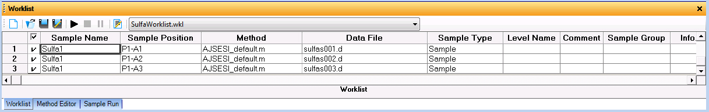
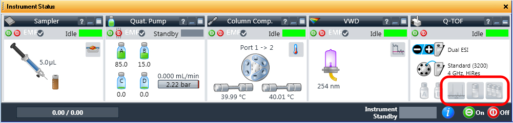

===================
Performing Analysis
===================

Starting a Run
^^^^^^^^^^^^^^^^

If :ref:`Mass Calibration / Check` was performed the ``LC`` flow will have been set to go to the ``MS`` automatically. Otherwise, perform the following steps to set the flow:
  
	#. Right click on the ``QTOF`` panel of the :guilabel:`Instrument Status` window in `MassHunter`

	#. Select :guilabel:`LC` → :guilabel:`Waste` from the menu.

		.. figure:: images/instrument_status_qtof.png
			:alt: The Instrument Status window

			The Instrument Status window

To start the run, in the :guilabel:`Worklist`, select the samples to run by ticking the box to the left of the `Sample Name` field and click the :guilabel:`▶` button.

	The Worklist

During the Run
^^^^^^^^^^^^^^^^^^

#. Check that the ``Column`` pressure remains stable and does not rise above 200 bar. Analysis should stop automatically if the pressure rises above 600 bar.
#. Check that the three symbols in the ``Q-TOF`` panel of the :guilabel:`Instrument Status` window (shown below) remain green to indicate that the reference ions were found.

	The Instrument Status window
