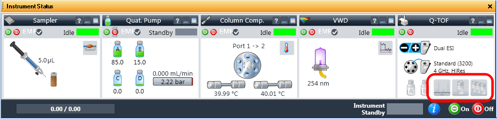

===============
During the Run
===============

#. Check that the ``Column`` pressure remains stable and does not rise above <value?>.
#. Check that the three symbols in the ``Q-TOF`` panel of the :guilabel:`Instrument Status` window (shown below) remain green to indicate that the reference ions were found.

	The Instrument Status window