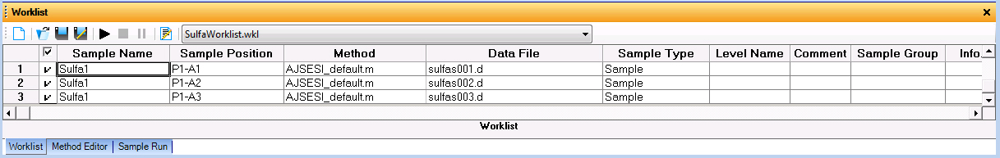

===============
Starting a Run
===============

#. <does LC need to be set to MS manually?>
#. In the :guilabel:`Worklist`, select the samples to run and click the :guilabel:`▶` button.

	The Worklist